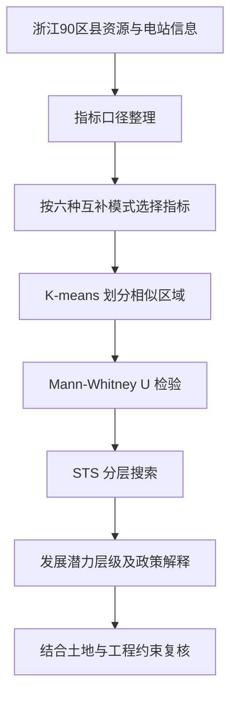

# 资源约束下的光伏互补发展｜浙江省区域政策研究

**Data-driven complementary policy development for photovoltaic industry facing resource constraints: A case study of Zhejiang Province in China**

Energy Strategy Reviews 64 (2026), 102128 · [DOI](https://doi.org/10.1016/j.esr.2026.102128) · [开放获取全文](paper.pdf)

[在线研究导览](https://jiangenjing.github.io/photovoltaic-complementary-policy/)

**核心问题：面对同样的光伏发展目标，不同地区应该选择怎样的互补模式？** 本项目将地区资源画像、聚类分析、统计检验和分层搜索串成一条政策分析链路，展示如何把地域差异转为有依据的政策建议。研究对象是区域发展潜力，不是实时电站调度或个人屋顶收益测算。

## 阅读导航与一次完整体验

先读[六类互补模式](#六类互补模式)了解业务场景，再看[DCD 框架](#dcd-框架各方法为什么不能互相替代)理解方法分工，最后结合[复现验收顺序](#从阅读到复现建议验收顺序)判断还需要哪些数据。

| 输入 | 中间分析 | 对决策者有用的输出 |
| --- | --- | --- |
| 区县、年份、资源指标与模式约束 | 口径统一、模式对应的指标筛选 | 可追溯的区域资源画像 |
| 可比较的地区特征 | 聚类及组间差异分析 | 分组理由与差异证据 |
| 统计结果与分层规则 | STS 及政策解释 | 候选发展方向、适用条件和待核实事项 |

**演示任务：** 在页面依次选择一种土地相关模式和一种海上相关模式，分别写下它依赖的资源、主要限制和需要补充的数据。接着回到论文，检查两种模式是否使用相同指标。目的不是证明某种模式“更好”，而是理解为何不同资源场景需要不同分析分支。

产品化时，使用者需要能够追溯“为什么某地区被推荐研究某种模式”。因此可解释的指标、数据年份和规则版本，比只展示一张潜力地图更重要。当前展示页用于方法沟通，不执行地区投资审批，也没有后台实时县域数据。

## 问题与研究对象

光伏扩张面临土地与资源约束。不同县域的自然资源、已有能源设施与产业条件不同，不能用同一发展方式替代区域诊断。研究以浙江省 **90 个区县**为对象，提出数据驱动互补发展（DCD）框架。

## 六类互补模式

| 缩写 | 模式 |
|---|---|
| MAPV | 山地农光互补 |
| FAPV | 平地农光互补 |
| FPV | 渔光互补 |
| PPV | 牧光互补 |
| OWS | 海上风光互补 |
| MWS | 山地风光互补 |

## 数据与技术链路

自然资源指标、可再生能源资源与已建电站信息 → 按互补模式选取相关指标 → K-means 区域分组 → Mann–Whitney U 差异检验 → STS 分层搜索 → 区域发展潜力与政策建议。

聚类描述资源特征相近的群体，不自动产生优劣排名；统计显著性也不等于商业收益或因果关系。分层需要论文规定的指标、检验和搜索规则。不能只凭“某县山区多”就伪造高潜力结论。

## DCD 框架：各方法为什么不能互相替代？



最后的实施复核是使用研究结果时必须补充的现实判断，不能认为统计分层自动获得了建设许可。

| 环节 | 主要回答的问题 | 不回答的问题 |
| --- | --- | --- |
| 指标整理 | 地区有哪些可比较的资源条件？ | 某项投资一定能否盈利？ |
| 聚类 | 哪些地区在所选特征上相近？ | 哪个地区因果意义上更好？ |
| 差异检验 | 比较对象是否存在可辨别的分布差异？ | 差异是否来自某一政策的净效果？ |
| 分层搜索 | 怎样按规则组织发展潜力层级？ | 具体电站的最优选址与融资方案？ |
| 政策解释 | 哪种互补模式值得优先进一步研究？ | 必须立即建设多少装机？ |

### 1. 数据：先建立可比较性

90 个区县是样本单位，六种互补模式是不同分析视角。不能把所有指标不加处理地塞入同一个模型，因为山地农光互补与海上风光互补依赖的条件不同。

复现所需的数据字典应至少含：区县标识、统计年份、指标名、单位、数据来源、缺失状态、方向性以及所属模式。行政区划调整、年份不一致和单位混用都会影响聚类结果。

下面只是待恢复数据的**字段设计示意**，并非论文原数据：

| 字段 | 用途 |
| --- | --- |
| `region_id`、`region_name` | 固定地区身份，避免同名或版本混淆 |
| `reference_year` | 标记统计口径 |
| `indicator_name`、`value`、`unit` | 明确每项指标含义和量纲 |
| `source`、`missing_flag` | 追踪来源与缺失处理 |
| `mode` | 说明该指标用于哪类互补分析 |

### 2. K-means：组织相似性而非自动评分

K-means 的通用目标是最小化组内平方距离：

$$\min_{C_1,\ldots,C_K}\sum_{k=1}^{K}\sum_{i\in C_k}\|z_i-\mu_k\|_2^2.$$

`z_i` 是地区特征，`μ_k` 是组中心。这个目标天然偏向在欧氏距离上紧凑的群体，所以指标尺度、异常值、K 值和随机初始化都会影响结果。

因此，不能把簇编号 0、1、2 直接当成低、中、高潜力。必须回到指标含义、统计差异和论文的分层规则解释，也要用多次初始化检查结果稳定性。

### 3. Mann–Whitney U：补充统计证据

检验基于秩进行两组比较，不要求采用正态均值比较的相同假设。但一般情况下，它不是单纯“中位数检验”；只有在适当的分布形状等条件下，位置差异的解释才成立。

显著性应结合效应大小、样本量和实际含义理解。若进行大量模式、指标、组间比较，需要说明多重比较策略。这里列的是复现应核对的要求，不宣称已恢复论文的全部检验配置。

### 4. STS：把统计结果组织成层次

STS 分层搜索负责把前面的信息转成有规则的层次结构。仅知道名称不足以重写算法，需要查清节点代表什么、比较或分支条件是什么、何时停止以及如何处理并列结果。

本仓库没有用一个自定义加权总分冒充原 STS 实现。要复现，应先从正文与补充资料建立规则表，再按论文输出逐项验收。

## 个人角色

Enjing Jiang 为共同通讯作者；论文 CRediT 标注 **Data curation、Writing – original draft**。仓库据此介绍个人贡献，不扩大为全部算法的独立实现。

## 如何使用这个仓库

- 浏览 `paper.pdf` 核对研究定义与结果。
- 下载后打开 `index.html`，点击六种模式查看场景与方法解读。
- 页面为研究流程导览，不是已经部署的区县决策系统；未显示编造的县域排名或效益值。

## 复现边界与待补材料

原论文数据声明为按需提供，当前未取得 90 区县原始指标矩阵、完整处理代码与超参数快照。因此本仓库**不声称重现原聚类、显著性表或 STS 分层结果**。

若开展复现，至少需要：区县 ID 与版本、指标定义和单位、缺失值规则、标准化方法、各模式指标子集、聚类数选择、随机种子、显著性阈值与多重比较处理、STS 规则及最终标签。最后应将输出逐项对照论文表图。

## Demo 使用与仓库结构

```text
README.md       研究问题、方法链路、复现路线
index.html      六种互补模式的交互式方法导览
paper.pdf       按原许可保存的开放获取论文
ATTRIBUTION.md  论文来源与授权说明
```

点击页面中的 MAPV、FAPV、FPV、PPV、OWS、MWS 按钮，查看相应应用场景与实施约束；再沿着“资源画像—区域分组—统计区分—分层建议”阅读。页面没有在后台执行 90 区县的聚类，也不会生成未有数据支持的排名。

```bash
git clone https://github.com/jiangenjing/photovoltaic-complementary-policy.git
cd photovoltaic-complementary-policy
python3 -m http.server 8000
```

用浏览器访问 `http://localhost:8000/`。该页面无需数据库、模型权重或 API Key。

## 从阅读到复现：建议验收顺序

| 阶段 | 操作 | 验收输出 |
| --- | --- | --- |
| 论文导读 | 明确研究单位、六类模式与输出定义 | 一页概念与符号表 |
| 数据恢复 | 取得授权数据并核对年份、地区与单位 | 可追溯的数据字典和缺失统计 |
| 模式分支 | 复原每种模式的指标选择 | 六份指标清单与转换规则 |
| 聚类实验 | 固定参数和随机种子，重复运行 | 簇中心、成员、稳定性比较 |
| 检验与分层 | 恢复检验条件和 STS 规则 | 可核查的比较表和层级结构 |
| 结果对照 | 将输出与论文表图对应 | 一致项、差异项及原因记录 |
| 迁移评估 | 更换地区或年份后重新标定 | 不直接沿用旧结论的验证报告 |

### 这个框架适合迁移到哪里？

可以作为区域资源分类、差异化产业政策和多场景潜力分析的思路参考。但把框架迁移到其他省份时，指标、样本分布、政策条件与实施成本都需重新核验。它提供分析结构，不提供无需数据就成立的全国排名。

### 三个容易混淆的结论

- “资源条件相近”不等于“项目盈利能力相同”。
- “统计差异显著”不等于“政策带来显著改善”。
- “具有互补发展潜力”不等于“已完成工程可研并可立即建设”。

本项目希望展示的是从数据到区域建议的可解释路径，而不是用一个模型替代所有政策和工程判断。

## 方法补充：如何把区域分组解释给政策使用者？

聚类结束后，首先应展示每组的指标分布与地区构成，而不是直接给簇编号贴上“优质”标签。若一组地区在土地资源上更丰富、但电网接入或生态约束更强，政策建议必须保留这种权衡。资源潜力、技术可行性和投资可行性是不同层次，需要不同证据。

复现 K-means 时，应记录标准化、K 值、初始化方法、重复次数和随机种子。官方文档说明了这些参数及其含义，尤其适合检查依赖版本变化后默认值是否发生变化。具体参见 [KMeans 官方接口](https://scikit-learn.org/stable/modules/generated/sklearn.cluster.KMeans.html)。保存簇中心和地区成员，比只保留彩色地图更有助于复核。

Mann–Whitney U 的结果则应连同样本量、检验方向和分布描述一起解释。小 p 值不提供差异的经济量级，未显著也不证明两组完全相同；当样本较少或存在并列秩时，需要核对所用计算方法。参见 [SciPy 的 Mann–Whitney U 说明](https://docs.scipy.org/doc/scipy/reference/generated/scipy.stats.mannwhitneyu.html)。这些是统计方法补充，不代表仓库已经执行了新的区县检验。

### 迁移到另一地区时，哪些环节必须重做？

首先核对行政区划和统计年份；其次检查指标在新地区是否仍有相同含义，例如同一土地类型是否允许相同开发模式；然后重新处理缺失值、尺度和聚类参数，最后复核政策约束与实际项目成本。可以复用的是分析流程，不是浙江样本的簇标签和潜力排序。

向决策者交付时，建议形成“区域特征—候选模式—约束条件—待核实数据—下一步可研”的五列表。这样既保留量化研究的依据，也能让实施团队知道还需要补什么信息，而不是将模型层级误读为直接建设指令。

## 许可与引用

论文以 CC BY 4.0 公开，`paper.pdf` 为未修改原件；详见 [ATTRIBUTION.md](ATTRIBUTION.md)。引用请使用 DOI 页面所列作者和文献信息。网页说明不能替代正式论文。
